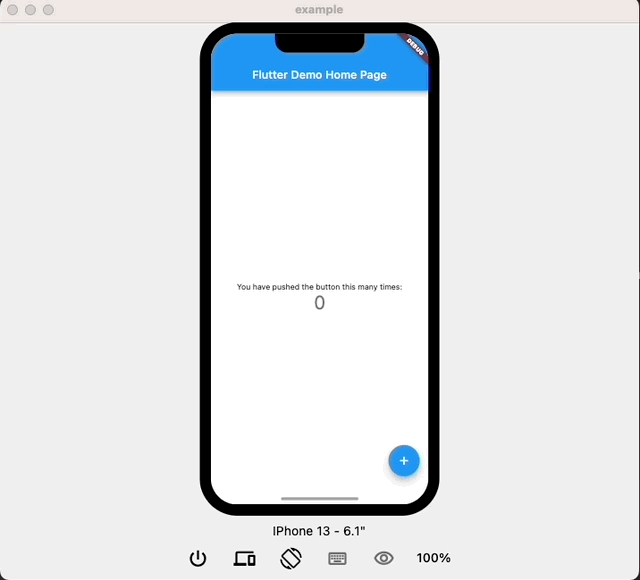
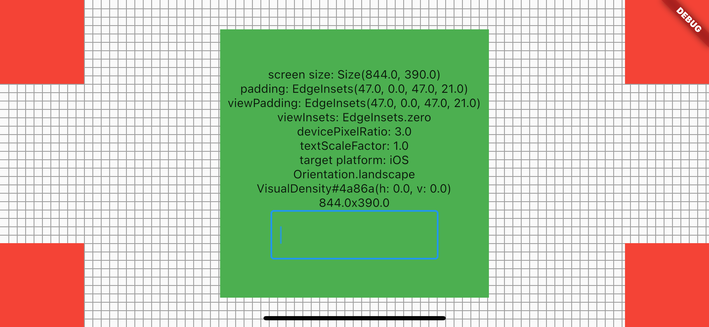

A device simulator to speed up development for different devices.

Approximates how an app looks and behaves on a device by simulating:

- frame
- notches, home indicators etc.
- screen size and resolution
- orientation
- safe areas
- keyboard insets
- visual density
- text styles
- (and more)



## Usage

1. Wrap your app with the `DeviceSim` widget.
2. Add `useInheritedMediaQuery: true` to your app.
    ```
    DeviceSim(
      ...
      builder: (context) => MaterialApp(
        ...
        useInheritedMediaQuery: true,
        ...      
    ))
    ```
3. Open your app as desktop or web app.

## Properties

| Name        | Description                     | Default value                               |
|-------------|---------------------------------|---------------------------------------------|
| `isEnabled` | whether the simulator is active | true if on web or desktop                   |
| `devices`   | list of simulated devices       | `iphone13`, `iphone13ProMax`, `ipad129Gen5` |

## Devices

### Available Devices

- `iphone13` iPhone 13
- `iphone13pro` iPhone 13 pro
- `iphone13ProMax` iPhone 13 pro max
- `iphone13Mini` iPhone 13 mini
- `iphoneSeGen3` iPhone SE (3rd gen.)
- `ipad129Gen5` 12.9" iPad Pro (5th gen.)
- `googlePixel5` Google Pixel 5 (as in SystemUiMode.edgeToEdge with systemNavigationBarColor transparent)
- more will follow


### Custom Devices

Implement a new `DeviceConfiguration`:

```
const myDevice = DeviceConfiguration(
    name: 'My Device',
    frameConfiguration: FrameConfiguration(
      frameInsets: EdgeInsets.all(20.0),
      outerRadius: BorderRadius.all(Radius.circular(68)),
      innerRadius: BorderRadius.all(Radius.circular(48)),
      features: [
        StaticFeature(
            portraitAlignment: Alignment.topCenter,
            child: IPhone13Notch(
              width: 174.0,
              height: 38.0,
            )),
      ],
    ),
    screenConfiguration: ScreenConfiguration(
        standardRectangleDiagonalInInch: 5.42,
        size: Size(375.0, 812.0),
        portraitPadding: EdgeInsets.fromLTRB(0.0, 50.0, 0.0, 34.0),
        portraitViewPadding: EdgeInsets.fromLTRB(0.0, 50.0, 0.0, 34.0),
        portraitViewInsets: EdgeInsets.fromLTRB(0.0, 0.0, 0.0, 0.0),
        portraitPaddingIfKeyboard: EdgeInsets.fromLTRB(0.0, 50.0, 0.0, 0.0),
        portraitViewPaddingIfKeyboard: EdgeInsets.fromLTRB(0.0, 50.0, 0.0, 34.0),
        portraitViewInsetsIfKeyboard: EdgeInsets.fromLTRB(0.0, 0.0, 0.0, 336.0),
        landscapePadding: EdgeInsets.fromLTRB(50.0, 0.0, 50.0, 21.0),
        landscapeViewPadding: EdgeInsets.fromLTRB(50.0, 0.0, 50.0, 21.0),
        landscapeViewInsets: EdgeInsets.fromLTRB(0.0, 0.0, 0.0, 0.0),
        landscapePaddingIfKeyboard: EdgeInsets.fromLTRB(50.0, 0.0, 50.0, 0.0),
        landscapeViewPaddingIfKeyboard: EdgeInsets.fromLTRB(50.0, 0.0, 50.0, 21.0),
        landscapeViewInsetsIfKeyboard: EdgeInsets.fromLTRB(0.0, 0.0, 0.0, 209.0),
        textScaleFactor: 1.0,
        devicePixelRatio: 3.0,
        targetPlatform: TargetPlatform.iOS,
        features: [
          Align(
            alignment: Alignment.bottomCenter,
            child: HomeIndicator(
              widthInPortrait: 134.0,
              widthInLandscape: 210.0,
            ),
          ),
        ]));
```

`CalibrationScreen` helps to find the correct values for the `ScreenConfiguration`. Just open it on a real device or emulator and find the values by rotating the device and opening and closing the keyboard. 

```
void main() {
  runApp(const MaterialApp(
    home: CalibrationScreen(),
  ));
}
```


